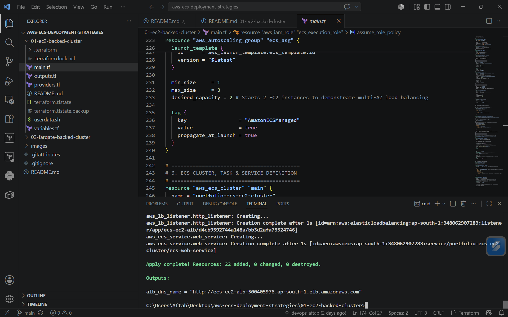
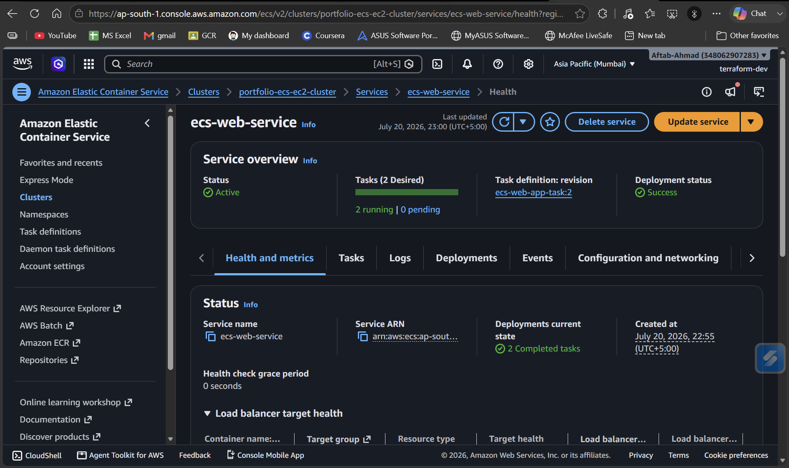
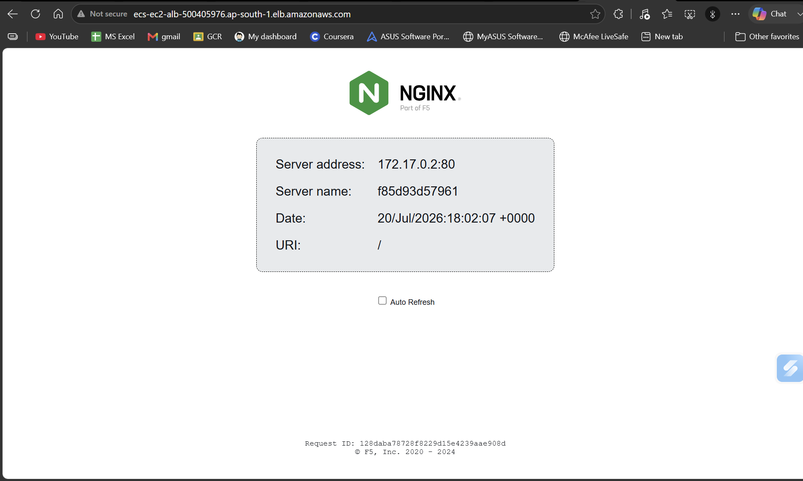
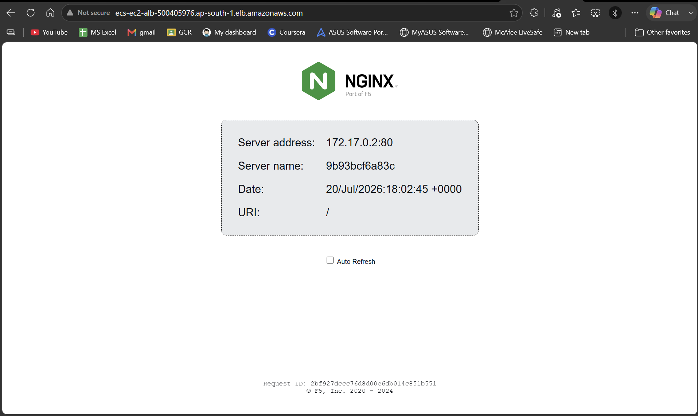

# AWS ECS Cluster (EC2-Backed) with Terraform

This repository provisions a highly available, load-balanced Amazon ECS (Elastic Container Service) cluster backed by an Auto Scaling Group of EC2 host instances. The infrastructure is built fully from scratch using infrastructure as code (IaC) with Terraform.

##  Architecture Overview


The configuration deploys a complete, secure infrastructure stack that includes:

1. **Networking**: A custom VPC across two Availability Zones with Public Subnets, an Internet Gateway, and public routing tables.
2. **Security**: Separated Security Groups ensuring that the public internet can only access the Application Load Balancer (ALB) on port 80, and the EC2 instances only accept traffic routed directly from the ALB.
3. **Load Balancing**: An Application Load Balancer configured with dynamic target group tracking to handle inbound web traffic.
4. **Compute & Auto Scaling**: An Auto Scaling Group (ASG) utilizing a Launch Template that dynamically fetches the latest official AWS ECS-optimized Amazon Linux 2 AMI.
5. **Container Orchestration**: An ECS Cluster orchestrating an NGINX demo application utilizing **Dynamic Host Port Mapping** and Docker `bridge` networking.

---

##  Key Design Patterns Demonstrated

### Dynamic Host Port Mapping
Instead of binding container applications to a hardcoded host port (which prevents multiple containers of the same type from running on a single instance), this configuration sets `hostPort = 0`. This instructs the ECS container agent and Docker to allocate a random ephemeral port on the EC2 host. The ECS Service automatically registers these dynamic ports with the ALB Target Group, allowing multiple container tasks to run smoothly across fewer host machines without resource collisions.

### Secure Principle of Least Privilege
* **ECS Instance Profile**: Grants the underlying EC2 hosts permissions to communicate with the ECS control plane, register into the cluster, and pull container configurations.
* **ECS Task Execution Role**: Dedicated role allowing the core ECS container engine to pull application images and push logging output.

### Zero-Downtime Launch Templates
The EC2 launch configuration utilizes a `name_prefix` and a `create_before_destroy` lifecycle policy. This ensures that if the host layout or configuration changes, Terraform spins up the new configuration first before tearing down the old one, preventing AWS `EntityAlreadyExists` dependency blocks or cluster registration locks.

---

## File Structure

* `main.tf` - Core infrastructure: VPC, Security Groups, ALB, ASG, and ECS configuration.
* `provider.tf` - Defines the AWS provider version limits and deployment region.
* `variables.tf` - Exposed variables for cluster customization (e.g., instance types, CIDR blocks).
* `outputs.tf` - Outputs the final public-facing endpoint of the application load balancer.
* `userdata.sh` - Standard shell script mapping the EC2 host node to the specific target ECS cluster upon boot.

---

## Getting Started

### Prerequisites
* [Terraform](https://www.terraform.io/downloads.html) (`>= 1.0.0`)
* Configured AWS CLI credentials with appropriate permissions

### Deployment Steps

1. **Initialize the workspace**
```bash
   terraform init
   terraform plan
   terraform apply
```

### Deployment Verification

#### 1. Terraform Deployment Output


#### 2. Service & Task Status


#### 3. ALB Load Balancing Test


| Task 1 Response | Task 2 Response |
| :---: | :---: |
|  |  |