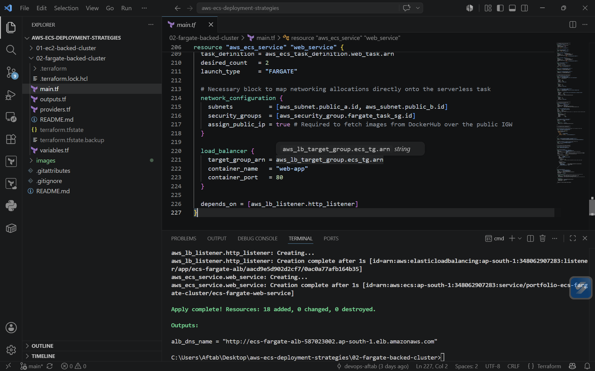
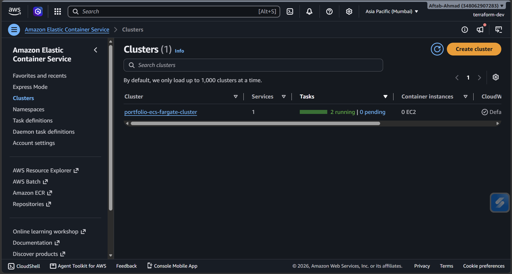
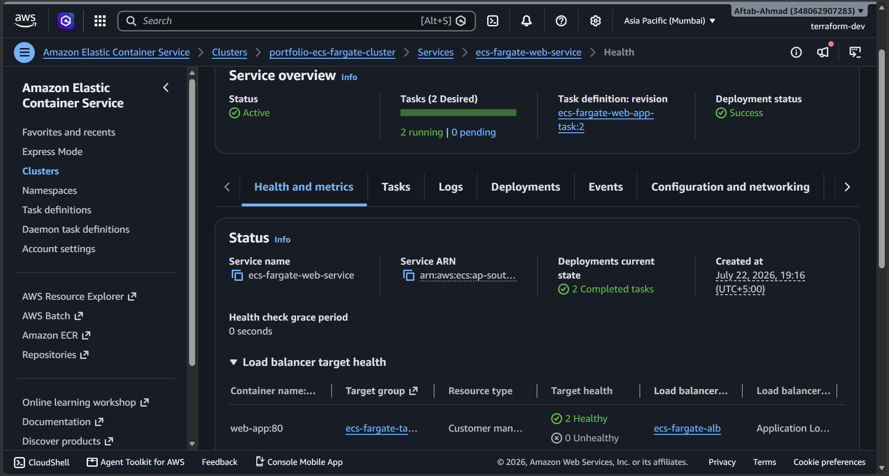
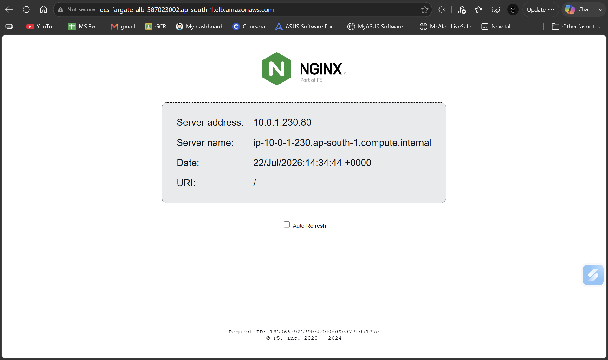
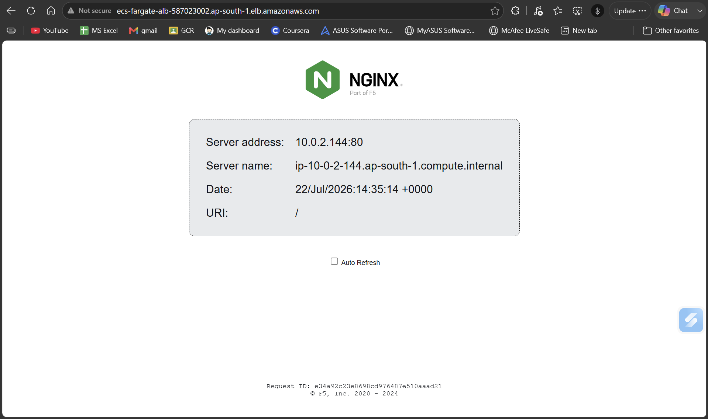

# Strategy 02: AWS ECS Fargate-Backed (Serverless) Cluster

This component of the portfolio demonstrates how to deploy a containerized web application using **Amazon ECS with AWS Fargate**. By moving to a serverless container architecture, we completely eliminate the operational overhead of provisioning, configuring, and scaling underlying EC2 host instances.

##  Architectural Overview

The infrastructure is built entirely from scratch using Terraform and consists of the following components:

*   **Networking:** A dedicated VPC with an Internet Gateway and 2 Public Subnets distributed across two Availability Zones for high availability.
*   **Routing & Load Balancing:** An Application Load Balancer (ALB) acting as the single public entry point, forwarding traffic to target groups using IP-based routing.
*   **Compute (Serverless):** An ECS Cluster running Amazon ECS tasks powered by AWS Fargate. 
*   **Security:** Isolated Security Groups enforcing the principle of least privilege (the ALB accepts public HTTP traffic on port 80 and shifts it directly to the Fargate tasks; tasks refuse all non-ALB ingress).
*   **Observability:** A CloudWatch Log Group dedicated to capturing and streaming container standard output (`stdout`/`stderr`) logs.

---

## Core Shifts: How This Differs From Lab 01 (EC2-Backed)

When transitioning a workload from EC2-backed ECS to Fargate, the structural approach changes significantly:

1.  **Zero Server Management:** The `aws_launch_template`, `aws_autoscaling_group`, and shell bootstrap scripts (`userdata.sh`) are entirely eliminated[cite: 1, 5]. AWS manages the underlying compute infrastructure.
2.  **IP-Based Target Groups:** Instead of mapping the ALB to an instance ID using dynamic host ports, Fargate uses the native `awsvpc` network mode[cite: 1]. Each container task gets its own dedicated Elastic Network Interface (ENI) and private IP within the VPC, meaning the ALB targets tasks directly by **IP address**[cite: 1].
3.  **Task-Level Resource Caps:** In an EC2 cluster, CPU and memory limits are optionally declared per container inside the task definition[cite: 1]. In Fargate, explicit hardware constraints (e.g., 256 CPU units, 512MB RAM) must be defined at the parent **Task level** for billing and scheduling allocation[cite: 1].
4.  **Direct Image Pulling:** Because Fargate tasks attach directly to your subnets without a proxy host EC2 node, they require a path to the internet to pull public container images (like Nginx). In this public-subnet sandbox layout, `assign_public_ip = true` is enabled to allow the ECS agent to communicate with DockerHub.

---

## File Structure

```text
02-fargate-backed-cluster/
├── main.tf          # Core infrastructure (VPC, ALB, IAM, ECS Cluster/Service/Task)
├── variables.tf     # Configurable inputs (AWS Region, CIDR blocks)
├── outputs.tf       # Resulting endpoints (Public ALB URL)
└── provider.tf      # Terraform core and AWS provider version locks
```

### 1. Terraform Infrastructure Provisioning
Executed serverless ECS infrastructure provisioning creating 18 AWS resources (VPC, Subnets, ALB, Target Groups, and Fargate ECS Cluster).



### 2. Serverless Cluster & Service Health
Verified the cluster operates completely serverless (**0 EC2 instances**) with 2 active Fargate tasks mapped to a healthy ALB target group.

| Serverless Cluster State | Target Group & Service Health |
| :---: | :---: |
|  |  |

### 3. Application Load Balancer Verification
Tested traffic distribution across private Fargate tasks running across distinct subnets (`10.0.1.x` and `10.0.2.x`):

| Fargate Task 1 (Subnet A) | Fargate Task 2 (Subnet B) |
| :---: | :---: |
|  |  |