# AWS ECS Deployment Strategies Portfolio

[](https://www.terraform.io/)
[](https://aws.amazon.com/ecs/)
[](LICENSE)

Welcome to my AWS ECS (Elastic Container Service) reference architecture portfolio. This repository contains end-to-end, fully automated infrastructure configurations built with **Terraform** to demonstrate two production-grade deployment methodologies on AWS: **EC2-backed** and **Fargate-backed** ECS clusters.

Each strategy is completely isolated, self-contained, and engineered to reflect cloud architecture best practices — high availability, security isolation, and least-privilege access.

---

## Architecture at a Glance

| EC2-Backed Cluster | Fargate-Backed Cluster |
|---|---|
| 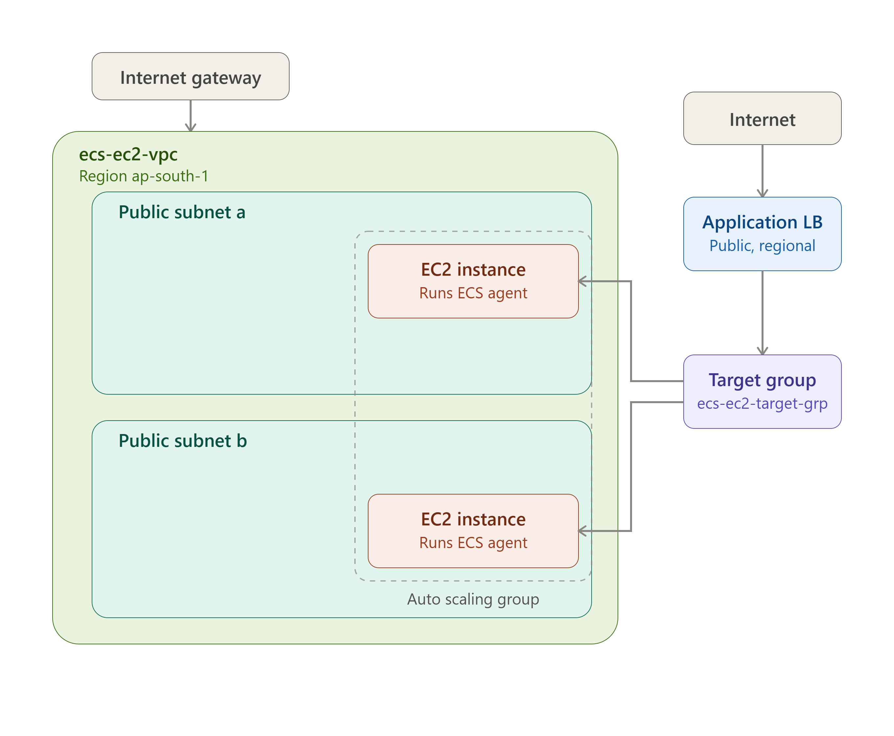 | 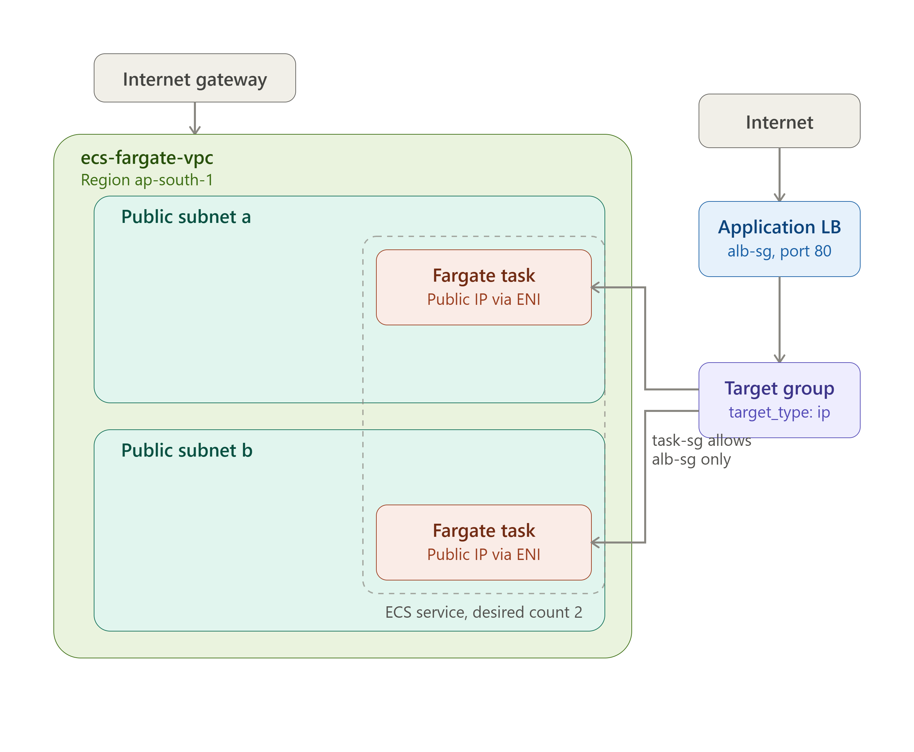 |

---

## Strategy Comparison

| | **EC2-Backed Cluster** | **Fargate-Backed Cluster** |
|---|---|---|
| **Compute Model** | Self-managed EC2 fleet via Auto Scaling Group | Fully serverless, AWS-managed compute |
| **Host Management** | Manual patching, scaling, AMI updates (via SSM) | Zero host provisioning or maintenance |
| **Networking** | Docker bridge mode, dynamic host port mapping (`hostPort = 0`) | `awsvpc` mode, task-level ENIs & security groups |
| **Cost Profile** | Cheaper at high, sustained density (pay for EC2 uptime) | Pay-per-task, better for variable/bursty workloads |
| **Isolation** | Shared host kernel across tasks | Full task-level network isolation |
| **Best For** | Cost optimization via container density, custom OS-level control | Cloud-native microservices, minimal ops overhead |

---

## Repository Structure

The project is divided into two isolated Terraform stacks so you can compare host-managed vs. serverless container orchestration side-by-side:

### [`01-ec2-backed-cluster/`](./01-ec2-backed-cluster)

- Dynamic, official ECS-optimized AMIs fetched via SSM Parameter Store
- Multi-AZ public VPC with custom routing
- Dynamic host port mapping for optimized container placement density
- ALB integration routing traffic to ephemeral host ports

**Request Flow:**
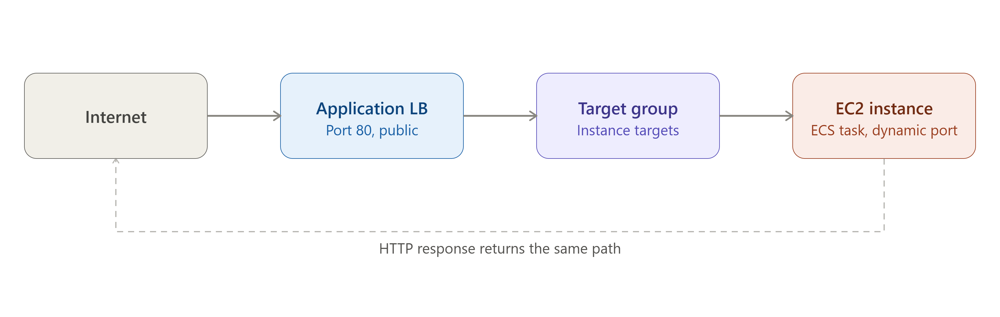

<details>
<summary><strong>Deployment Proof</strong> (click to expand)</summary>

| Terraform Apply | ECS Cluster Console |
|---|---|
| 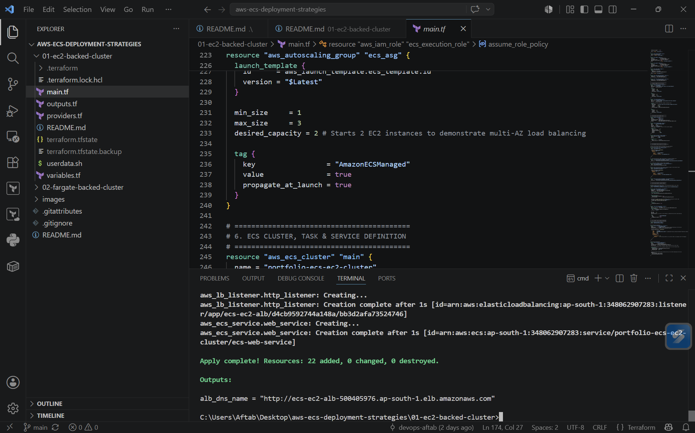 | 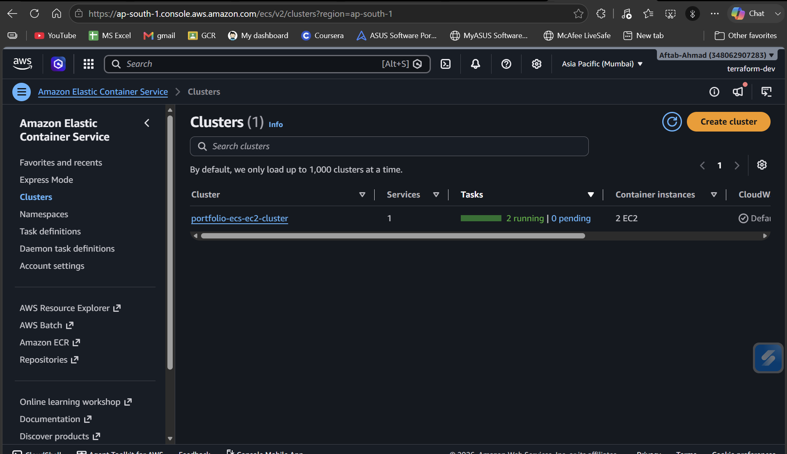 |

| Service Status | ALB Load Balancing |
|---|---|
| 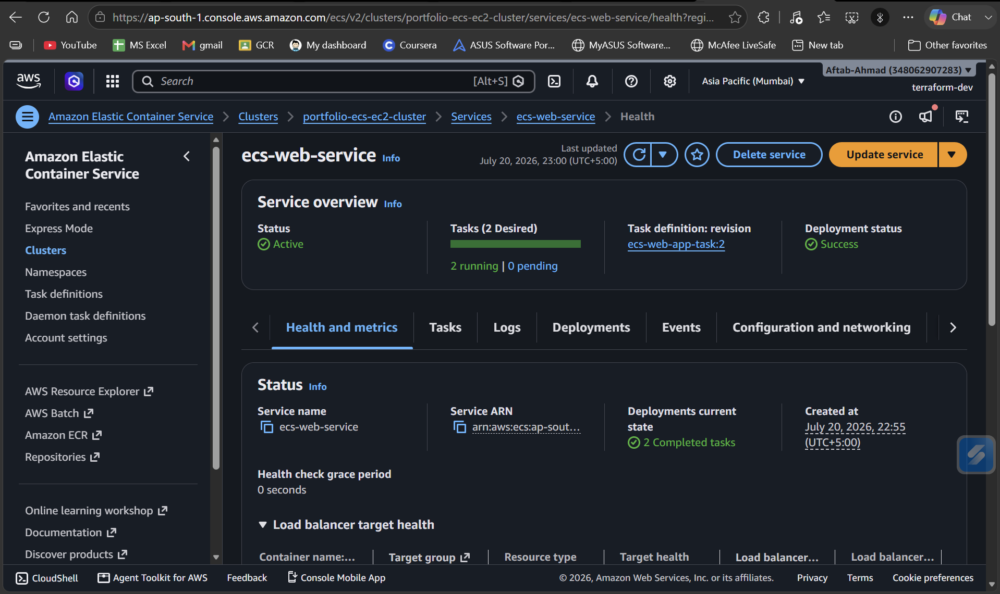 | 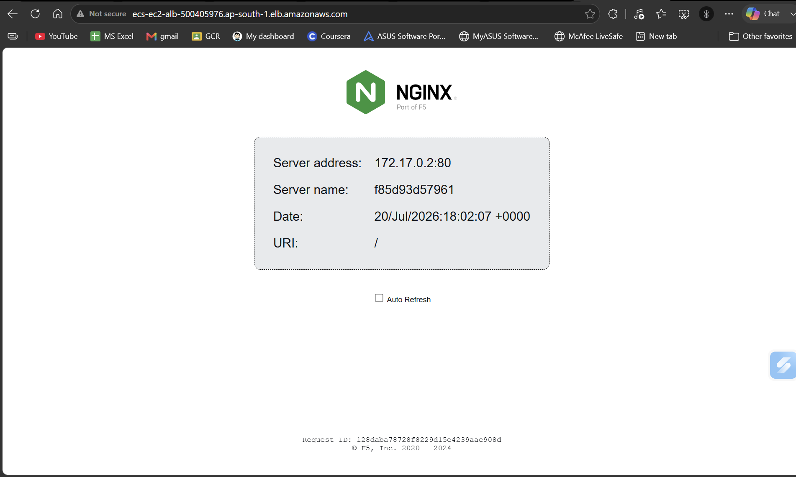 |

</details>

### [`02-fargate-backed-cluster/`](./02-fargate-backed-cluster)

- Zero-infrastructure, serverless compute — no host provisioning or scaling to manage
- Strict network-level container isolation via `awsvpc` mode
- Direct task-level security group assignments

**Request Flow:**
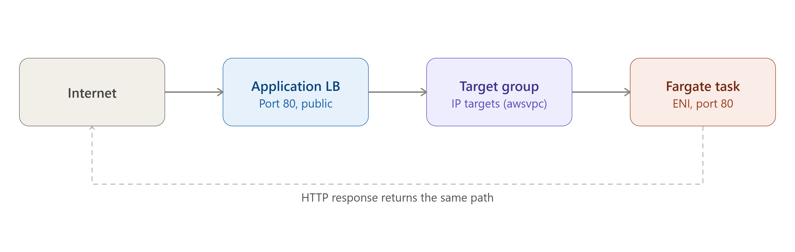

<details>
<summary><strong>Deployment Proof</strong> (click to expand)</summary>

| Terraform Apply | ECS Cluster Console |
|---|---|
| 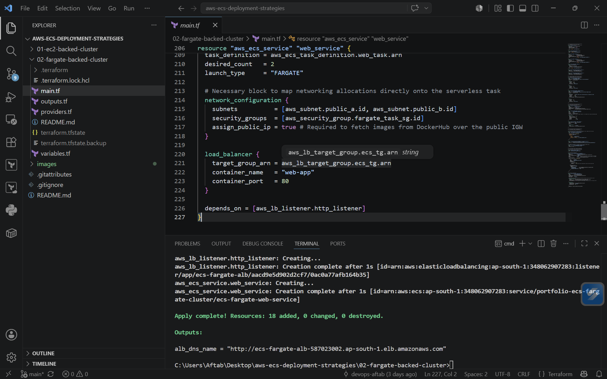 | 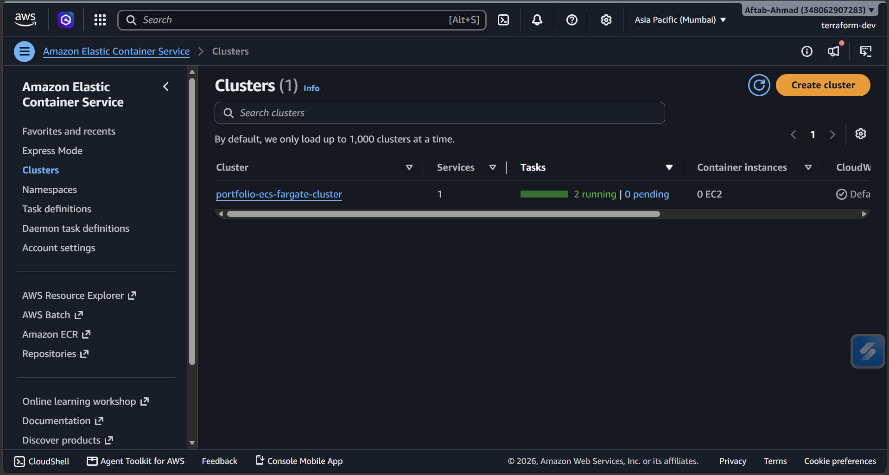 |

| Service Status | ALB Load Balancing |
|---|---|
| 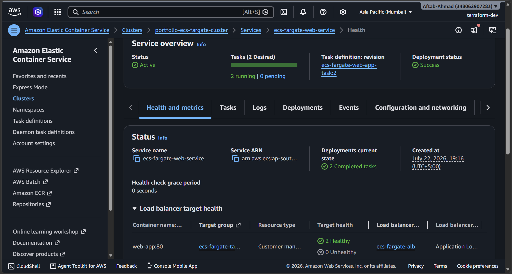 | 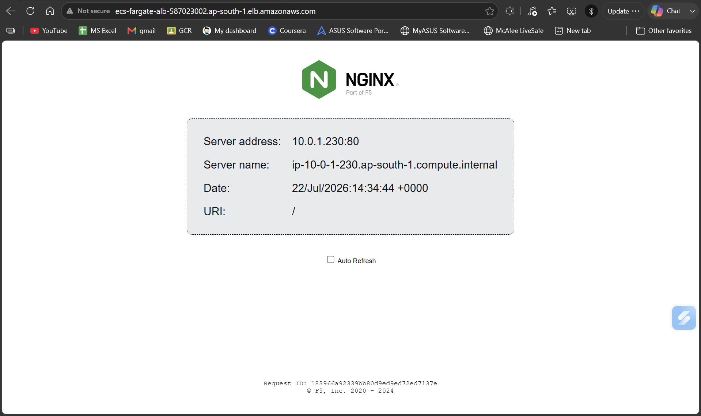 |

</details>

---

## General Prerequisites

To run either deployment blueprint, you'll need:

- **Terraform** (`>= 1.0.0`)
- **AWS CLI** configured with appropriate administrative credentials
- An active AWS Account

```bash
cd 01-ec2-backed-cluster   # Or 02-fargate-backed-cluster
terraform init
terraform plan
terraform apply
```

## License

This project is licensed under the MIT License.